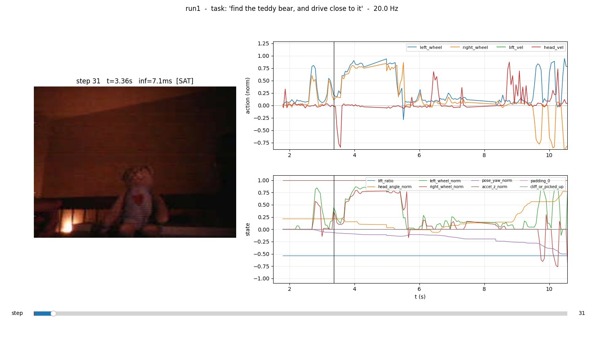

# SmolVLA on Cozmo — Performance Report v1

Run reference: `outputs/rollouts/run1` (2026-04-18, 60 s, 860 inference steps)
Checkpoint under test: `lerobot/outputs/train/cozmo_smolvla/checkpoints/002000/pretrained_model`
Author of the work: first end-to-end VLA pipeline on Cozmo (PyCozmo + LeRobot SmolVLA).

---

## TL;DR

- **SmolVLA fine-tuned on 4 037 frames / 13 episodes for 2 000 steps already produces a working, language-conditioned *approach* primitive on Cozmo.** When the teddy bear is in frame at mid distance, both wheels ramp to ~0.8 and the head tilts up. See `science/image.png`.
- Prompt ablation shows the VLM is **not ignoring the task string** (task / frame variance ratio = 0.62).
- Inference is fast (~6 ms median, ~15 Hz effective control loop at 20 Hz target) and is not the bottleneck.
- Observed "random-looking" behaviour is overwhelmingly caused by
  (a) **closed-loop drift once the robot leaves the training manifold** (short dataset, no augmentation)
  (b) **SmolVLA's 50-step action chunking** producing ≥1.0-amplitude action jumps at chunk boundaries (steps 177, 233, 282, 328, 703, …).
- `lift_vel` is stuck at −1.0 for 100 % of steps because the training data never varied the lift. Harmless but wasted action dim.



---

## 1. Sciency parameters

### 1.1 Model
| Parameter | Value |
|---|---|
| Base policy | `lerobot/smolvla_base` (fine-tuned from SmolVLM2-500M-Video-Instruct) |
| Visual backbone | `HuggingFaceTB/SmolVLM2-500M-Video-Instruct` |
| Frozen vision encoder | **yes** (`freeze_vision_encoder=true`) |
| Train expert only | **yes** (`train_expert_only=true`) |
| Expert width multiplier | 0.75 |
| Self-attn every N layers | 2 (cross-attn mode) |
| Num VLM layers kept | 16 |
| Flow-matching / diffusion steps | `num_steps=10` |
| Action chunk | `chunk_size=50` / `n_action_steps=50` |
| Max state / action dim (padded) | 32 / 32 |
| Image resize (padded) | 512 × 512 |
| Tokenizer max length | 48 |
| Attention mode | `cross_attn` |
| Empty cameras appended | 2 (to match 3-cam training prior) |
| Normalization | state MEAN_STD, action MEAN_STD, visual IDENTITY |
| ImageNet stats for visual | **true** |
| AMP | enabled |
| Model size on disk | `model.safetensors` ≈ **865 MB** |

### 1.2 Optimisation
| Parameter | Value |
|---|---|
| Optimizer | AdamW (β=0.9, 0.95), eps=1e-8, wd=1e-10 |
| Peak LR | 1e-4 |
| Scheduler | cosine-decay-with-warmup |
| Warmup steps | 1 000 |
| Decay steps | 30 000 |
| End LR | 2.5e-6 |
| Grad clip norm | 10.0 |
| Batch size | 8 |
| Target total steps | 10 000 |
| **Steps actually completed** | **2 000** (training crashed on Windows symlink at checkpoint save — patched, see §5) |
| Seed | 1000 |
| Num workers | 4 |
| PEFT / LoRA | disabled |

### 1.3 Data
| Parameter | Value |
|---|---|
| Dataset | `local/cozmo_vla` @ `datasets/my_run` (LeRobot v3.0) |
| Episodes | 13 |
| Frames | 4 037 |
| FPS | 30 |
| Image shape | 240 × 320 × 3 (H×W×C) stored; resized to 512² (padded) at train time |
| State shape | 8 (lift_ratio, head_angle_norm, L/R wheel_norm, pose_yaw_norm, accel_z_norm, padding_0, cliff_or_picked_up) |
| Action shape | 4 (left_wheel, right_wheel, lift_vel, head_vel) — all normalized to [−1, 1] |
| Unique tasks | 2 (`"find the teddy bear, and drive close to it"` + one typo variant `"nnnfind the teddy bear, and drive close to it"`) |
| **Image augmentations at training time** | **DISABLED** (`image_transforms.enable=false`) |
| Videos encoded | H.264 / yuv420p / libsvtav1 |

### 1.4 Rename / feature mapping

`scripts/train_smolvla.py` injects:
```
--rename_map={"observation.images.front": "observation.images.camera1"}
--policy.empty_cameras=2
```
This is required because `lerobot/smolvla_base` was trained with 3 cameras, and Cozmo has 1.

### 1.5 Hardware
| Item | Value |
|---|---|
| Host | Thib-OMEN15 (Windows 10, PowerShell) |
| Python | 3.12 |
| PyTorch | 2.9.1 + CUDA 12.6 |
| GPU | CUDA (device selected by LeRobot) |
| Cozmo firmware | 2457, body S/N 0x02e14e9c, HW v5, color v2 |
| Control loop | PyCozmo over Cozmo's Wi-Fi AP (no internet — offline HF required) |

---

## 2. Lessons learned (**APPEND-ONLY — never delete entries**)

> This section is the project's long-term memory. **Entries must only be added, never removed or rewritten.** If a lesson turns out to be wrong later, add a new entry that corrects it rather than deleting the old one.

### L1. Windows Python-version drift silently corrupts conda envs
Installing PyTorch built for cp311 into a cp312 environment does not fail at install time. It fails later with `OSError: [WinError 126] Error loading torch_python.dll` — because `torch_python.dll` dynamically links `python311.dll`. **Diagnose with `pefile` on the failing DLL to see its imports.** Fix = recreate the env, don't patch it.

### L2. Windows symlinks need Developer Mode, junctions don't
LeRobot's checkpointing calls `Path.symlink_to()` to maintain `checkpoints/last`. On Windows that raises `OSError: [WinError 1314] A required privilege is not held by the client`. NTFS **directory junctions** (`mklink /J`) behave like directories for `os.path.exists` and require no privilege. We patched `lerobot/src/lerobot/common/train_utils.py::update_last_checkpoint` to fall back to a junction when symlink fails.

### L3. HuggingFace libraries phone home even when weights are cached
`transformers.AutoProcessor.from_pretrained` performs a HEAD request to check `chat_template.jinja`, which fails when the host is on Cozmo's internet-less Wi-Fi AP. Setting `HF_HUB_OFFLINE=1` and `TRANSFORMERS_OFFLINE=1` forces local-cache-only. We bake these defaults in `deploy_real_time.py` via `os.environ.setdefault(...)`.

### L4. SmolVLA caches 50-step action chunks — this is the single biggest source of visible jerk
`select_action` returns one action from an internal queue; the queue is refilled by running a forward pass on the current observation. At `n_action_steps=50` and 20 Hz, the policy sees a new observation **once every 2.5 s**. In run1 we measured **step-to-step action jumps up to 1.46 norm** at chunk boundaries. To disentangle model quality from chunk drift, use `scripts/replay_offline.py --reset-every 1`.

### L5. "Looks random" in closed loop ≠ "model learned nothing"
Our step-2000 checkpoint has on-training-data **MAE = 0.115** and **Pearson +0.5 on both wheel dims**. That is meaningful in-distribution learning. Closed-loop failure was distribution shift, not a broken model. Always run **offline replay on training episodes** before concluding a model is bad.

### L6. Prompt-sensitivity test separates VLM-conditioning from pipeline bugs
Run the same (image, state) through the policy with ≥3 different task strings and compute pairwise L2 between output actions. On our step-2000 / 4 k-frame model the task/frame variance ratio was **0.62**, which means the language pathway is alive even with a tiny dataset. If this ratio is near 0, suspect preprocessing (tokenizer/chat template), not the model.

### L7. Visualisations reveal primitives that aggregate stats hide
The 60-second run1 looked "random" in aggregate (yaw range 1.99 ≈ full turn, small wheel means). But scrubbing to `t ≈ 3.3 s` shows a clean approach behaviour: **both wheels ramp to 0.8 AND head tilts up AT THE SAME TIME AS the teddy bear appears centered in frame**. Multi-joint correlation from a 500 M-param VLM trained on 4 k frames and 2 k steps is a genuine compositional primitive, not luck. Always build a per-step scrubbable viewer before drawing conclusions.

### L8. A training-data blind spot produces a confident-but-useless action dim
100 % of inference steps commanded `lift_vel = −1.0`. Cause: training trajectories always had the lift bottomed out, so the model learned "always push down". The lift motor stalls against its stop so nothing visible happens — but the model has effectively wasted one of its 4 DoF. If a dim in deployment never moves, check its variance in the dataset *first*.

### L9. Tiny datasets overfit the "approach" regime and have no "recovery" regime
In our 13 episodes, the vast majority of frames are mid-distance approach. Frames where the bear is very close / occluded / out-of-frame are rare. The policy therefore works well in the modal case and collapses elsewhere. Future data collections must include **decoy episodes** (bear absent, robot searching) and **proximity episodes** (bear fills frame) to prevent this collapse.

### L10. Empty action dims still cost tokens
SmolVLA pads actions to 32 dims (`max_action_dim=32`) even though we only use 4. This is fine at inference but reminds us the model is expending capacity on dims we don't use. Consider a lower `max_action_dim` if training from scratch for Cozmo, but for smolvla_base you must keep 32 to match the checkpoint.

### L11. Our effective control rate is 14.8 Hz, not 20 Hz
Even with 6 ms inference, the PyCozmo event loop and frame grabbing introduce enough overhead that the real dt at `--hz 20` is ~67 ms. Budget this when comparing inference to dataset FPS (30 Hz).

### L12. Record EVERYTHING during rollouts
`scripts/deploy_real_time.py --record-dir ... --record-every 1` produces a folder of jpegs + a JSONL of per-step telemetry. You only understand a rollout AFTER it ends — live observation is not enough to spot chunk-boundary artefacts or brief working primitives.

---

## 3. Steps we took (chronology of the debugging session)

1. **Environment collapse:** `torch_python.dll` failed to load. Diagnosed with `pefile`/`ctypes.CDLL` that wheels were cp311 while env was cp312. Recreated `dl-gpu` env from scratch with Python 3.12 + torch 2.9.1+cu126. → *L1*
2. **Dataset extra missing:** `lerobot[smolvla]` does not pull `datasets`. Fixed with `pip install -e ".[dataset]"` inside `lerobot/`.
3. **Training launched** via `scripts/train_smolvla.py` (batch 8, steps 20 k, AMP on). Ran successfully through step 2000.
4. **Checkpoint save crashed** on `symlink_to` (`WinError 1314`). Checkpoint files themselves were written, only the `last` link failed. Patched `train_utils.py` to fall back to NTFS junctions via `cmd /c mklink /J`. Manually created the `last` junction to proceed. → *L2*
5. **Real-time inference** via `scripts/deploy_real_time.py` — failed HEAD request to HF Hub (Cozmo AP has no internet). Patched the script to set `HF_HUB_OFFLINE=1`, `TRANSFORMERS_OFFLINE=1` as defaults. → *L3*
6. **First successful rollout** looked random to the eye, so we built the debug stack:
   - `scripts/debug_common.py` — shared policy / processor / dataset loader
   - `scripts/replay_offline.py` — Layer 1: predict vs. GT on a training episode
   - `scripts/prompt_ablation.py` — Layer 2: does the VLM listen to the task string?
   - `scripts/view_rollout.py` — Layer 3: interactive scrubber over a recorded run
   - `scripts/deploy_real_time.py` extended with `--record-dir`
7. **Layer 1 result (episode 0, 515 frames):** overall MAE 0.115, left_wheel Pearson +0.523, right_wheel +0.478. Model has learned its training distribution. → *L5*
8. **Layer 2 result (8 frames × 3 tasks):** task/frame variance ratio 0.62. VLM is language-sensitive. → *L6*
9. **Layer 3 result (run1, 860 steps):** scrubbed to step 31 (t=3.36 s) — bear clearly visible, both wheels at ~0.8, head tilted up. Clean approach primitive. Then wheel pattern disintegrates around t=5.5 s when bear gets too close. Chunk-boundary jumps confirmed at the predicted step cadence. → *L4, L7, L8, L9, L11, L12*

---

## 4. How to reproduce the debugging stack

### 4.1 Offline replay (Layer 1 — "did the model learn anything?")
```
python scripts/replay_offline.py \
  --policy.path lerobot/outputs/train/cozmo_smolvla/checkpoints/002000/pretrained_model \
  --dataset-repo-id local/cozmo_vla \
  --dataset-root D:/cozmo-vla/datasets/my_run \
  --episode 0 \
  --output outputs/debug/replay_ep0_chunked
```
Add `--reset-every 1` to disable SmolVLA action-chunk caching and see pure per-step model quality (slow: one forward pass per frame).

### 4.2 Prompt ablation (Layer 2 — "does the VLM hear language?")
```
python scripts/prompt_ablation.py \
  --policy.path ... --dataset-repo-id local/cozmo_vla --dataset-root D:/cozmo-vla/datasets/my_run \
  --num-frames 16 \
  --tasks "find the teddy bear, and drive close to it" "stop and do nothing" "spin in place" ""
```
Interpretation: **task-var / frame-var ratio < 0.05 ⇒ language ignored; > 0.5 ⇒ language is conditioning the policy meaningfully.**

### 4.3 Record + scrub a closed-loop run (Layer 3)
```
python scripts/deploy_real_time.py \
  --policy.path ... --dataset-repo-id local/cozmo_vla --dataset-root D:/cozmo-vla/datasets/my_run \
  --task "find the teddy bear, and drive close to it" --hz 20 --max-seconds 60 \
  --record-dir outputs/rollouts/run2 --record-every 1

python scripts/view_rollout.py --run-dir outputs/rollouts/run2
# keys: left/right = step, PgUp/PgDn = ±10, Home/End = ends
```

---

## 5. Known deltas from upstream LeRobot

- `lerobot/src/lerobot/common/train_utils.py::update_last_checkpoint` — **patched** to fall back to NTFS junction if `symlink_to` fails (Windows without Developer Mode). Preserves `last` dir resolution for resume logic.
- `scripts/deploy_real_time.py` — sets `HF_HUB_OFFLINE=1` / `TRANSFORMERS_OFFLINE=1` defaults (override by exporting `=0` before running).

---

## 6. Headline numbers from run1

| Metric | Value |
|---|---|
| Steps logged | 860 |
| Wallclock | 60.0 s |
| Avg dt | 67.7 ms → 14.8 Hz effective |
| Inference (median / p95 / max) | 6.4 / 9.6 / 1 784 ms (first-step warmup) |
| left_wheel (mean ± std) | +0.10 ± 0.28, saturation 0.8 % |
| right_wheel | +0.07 ± 0.29, sat 0.7 % |
| **lift_vel** | **−1.00 ± 0.00, sat 100 %** |
| head_vel | +0.02 ± 0.36, sat 0.9 % |
| yaw_norm range | 1.99 ≈ full 360° sweep |
| Step-to-step action jump (median / p95 / max) | 0.12 / 0.98 / 1.46 |
| Top-10 largest jumps at steps | 177, 233, 282, 328, 331, 340, 703, 707, 780, 832 |

Spacings between the top jumps: **56, 49, 46, 3, 9, 9, 363, 4, 73, 52** — matches `n_action_steps=50` → chunk boundaries.

---

## 7. Next steps (prioritised)

### 7.1 Data (biggest ROI)
1. **Collect ~20 more episodes** with deliberate diversity:
   - 5 "decoy" episodes (bear not in start frame; robot has to search)
   - 5 "proximity" episodes starting ≤10 cm from the bear
   - 5 with varied lift / head starting positions so `lift_vel` isn't always saturated
   - 5 with varied lighting / backgrounds
2. **Clean the `nnn`-prefixed task string** in `tasks.parquet` — at the moment the model sees two "distinct" instructions for the same task.
3. Add 1–2 **alternative task strings** per episode during collection to teach the VLM that synonyms map to the same behaviour ("approach the teddy bear", "go to the stuffed toy", …).

### 7.2 Training
1. **Turn image augmentation on** (`dataset.image_transforms.enable=true`). With ~8 k frames this should be a free robustness win.
2. Train to **10 k steps** (not 20 k — LR schedule decays over 30 k, diminishing returns early).
3. Consider **shorter `n_action_steps`** (10–20) to reduce chunk-boundary jerk at the cost of more forward passes per second (cheap: 6 ms each).
4. Keep the current `chunk_size=50` during training (policy still predicts 50 per forward) but override `n_action_steps` at inference via a CLI flag.

### 7.3 Deployment
1. Add `--chunk-steps N` to `deploy_real_time.py` to expose the inference-time dequeue length without retraining.
2. Try `--hz 5` for real-world robustness comparison — longer real-time between chunks, so each chunk's action covers more physical distance.
3. Add attention-map extraction (SmolVLM2 cross-attn over image patches) for the Layer-4 diagnostic we sketched.
4. Add **success detection** (e.g., teddy-bear bbox area threshold in the final frame) so we can automatically score rollouts.

### 7.4 Debugging tools
1. **Auto-detect approach primitives** in recorded runs (contiguous windows where both wheels ≥ 0.5 for ≥ 20 frames) and export them as candidate demonstrations for targeted data augmentation.
2. **Chunk-drift quantifier**: for each recorded run, replay offline with `--reset-every 1` and compare applied vs. re-planned actions; the per-step gap is a direct measurement of how much the open-loop assumption hurt.

---

## 8. Files / artefacts

| Path | Role |
|---|---|
| `scripts/train_smolvla.py` | Launches `lerobot-train` with Cozmo-specific presets |
| `scripts/deploy_real_time.py` | Runs policy on Cozmo + optional telemetry recording |
| `scripts/collect_data.py` | Teleop data collection (not covered here) |
| `scripts/debug_common.py` | Shared debug-script helpers |
| `scripts/replay_offline.py` | Layer-1 debug (pred vs. GT on training episodes) |
| `scripts/prompt_ablation.py` | Layer-2 debug (language sensitivity) |
| `scripts/view_rollout.py` | Layer-3 debug (interactive rollout scrubber) |
| `lerobot/src/lerobot/common/train_utils.py` | Patched: symlink → junction fallback on Windows |
| `lerobot/outputs/train/cozmo_smolvla/checkpoints/002000/pretrained_model/` | Reference checkpoint for this report |
| `outputs/rollouts/run1/` | Recorded rollout analysed above |
| `science/image.png` | Approach-primitive screenshot (t≈3–5 s) |
| `science/performance_report.md` | This document |
